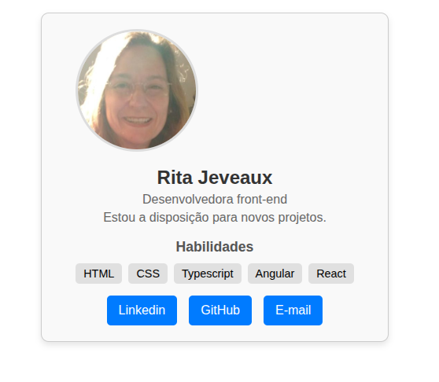

# Cartão de Visita em Angular

Este é um projeto simples desenvolvido como parte de um exercício do Módulo 4 do curso de Angular da ADA. O objetivo foi criar um componente de "cartão de visita" que exibe informações de perfil estáticas.

O projeto foi desenvolvido utilizando Angular e demonstra conceitos básicos da framework, como a criação de componentes, data binding e o uso de diretivas estruturais como `*ngFor`.

## 🖼️ Screenshot

<p align="center"></p>

## ✨ Tecnologias Utilizadas

- **Angular**: Framework principal para a construção da aplicação.
- **TypeScript**: Superset do JavaScript utilizado pelo Angular.
- **HTML & CSS**: Estrutura e estilização do componente.

## 📋 Pré-requisitos

Antes de começar, você vai precisar ter as seguintes ferramentas instaladas em sua máquina:

- **Node.js**: Versão **v20.x** ou superior.
- **Angular CLI**: Ferramenta de linha de comando do Angular.

Você pode instalar o Angular CLI globalmente com o comando:
```bash
npm install -g @angular/cli
```

## 🚀 Como Executar o Projeto

1. **Clone o repositório:**
   ```bash
   git clone <url-do-seu-repositorio>
   ```

2. **Acesse a pasta do projeto:**
   ```bash
   cd cartao-visita-angular
   ```

3. **Instale as dependências:**
   ```bash
   npm install
   ```

4. **Execute o servidor de desenvolvimento:**
   ```bash
   ng serve
   ```

5. **Acesse a aplicação:**
   Abra seu navegador e acesse `http://localhost:4200/`. A aplicação será recarregada automaticamente se você alterar qualquer um dos arquivos de origem.
